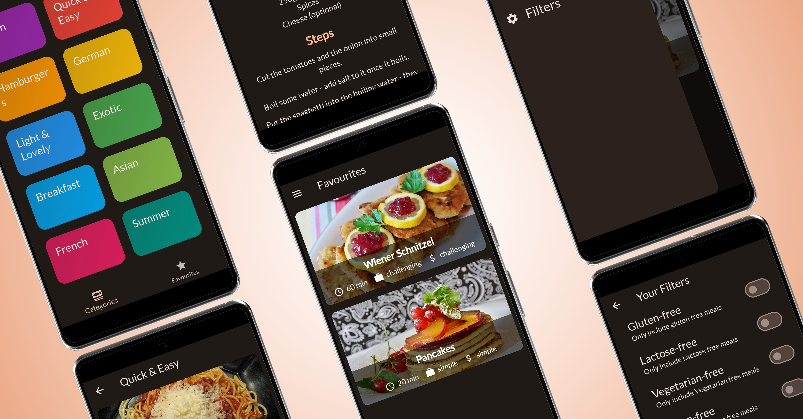
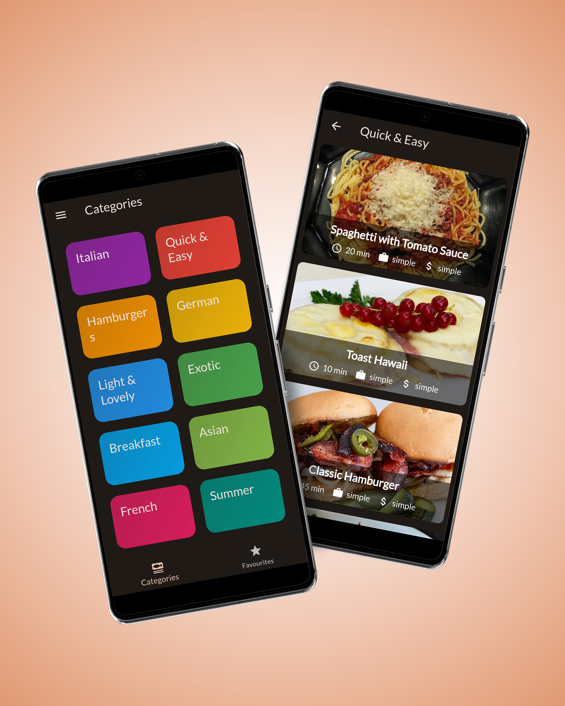
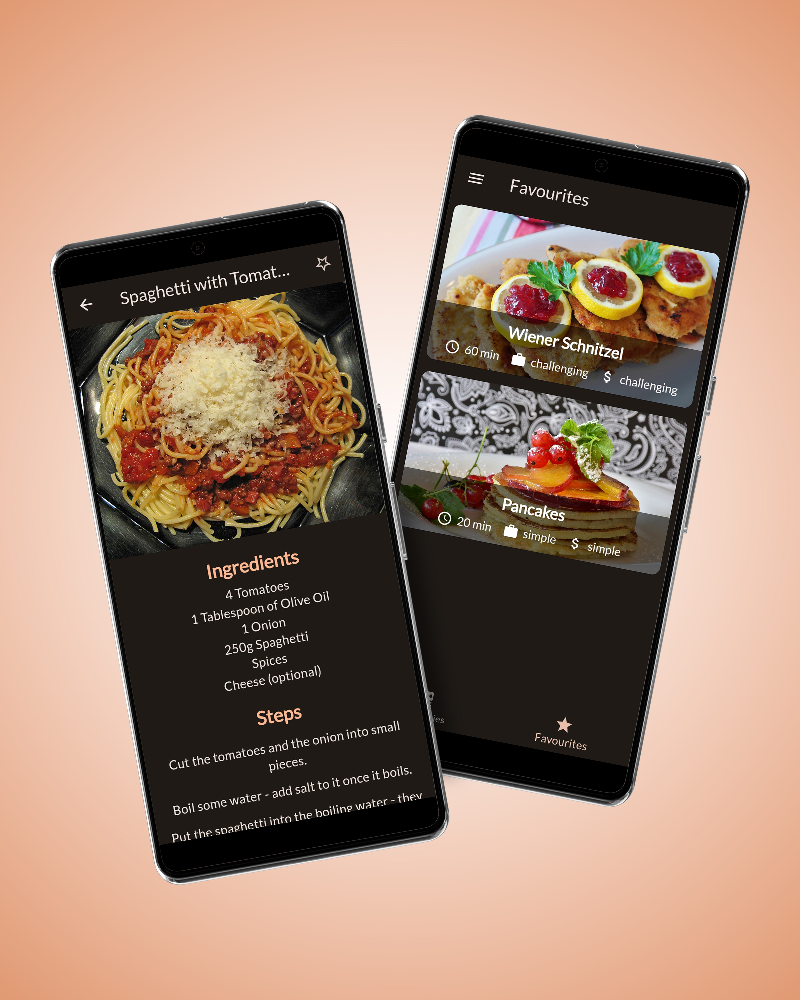
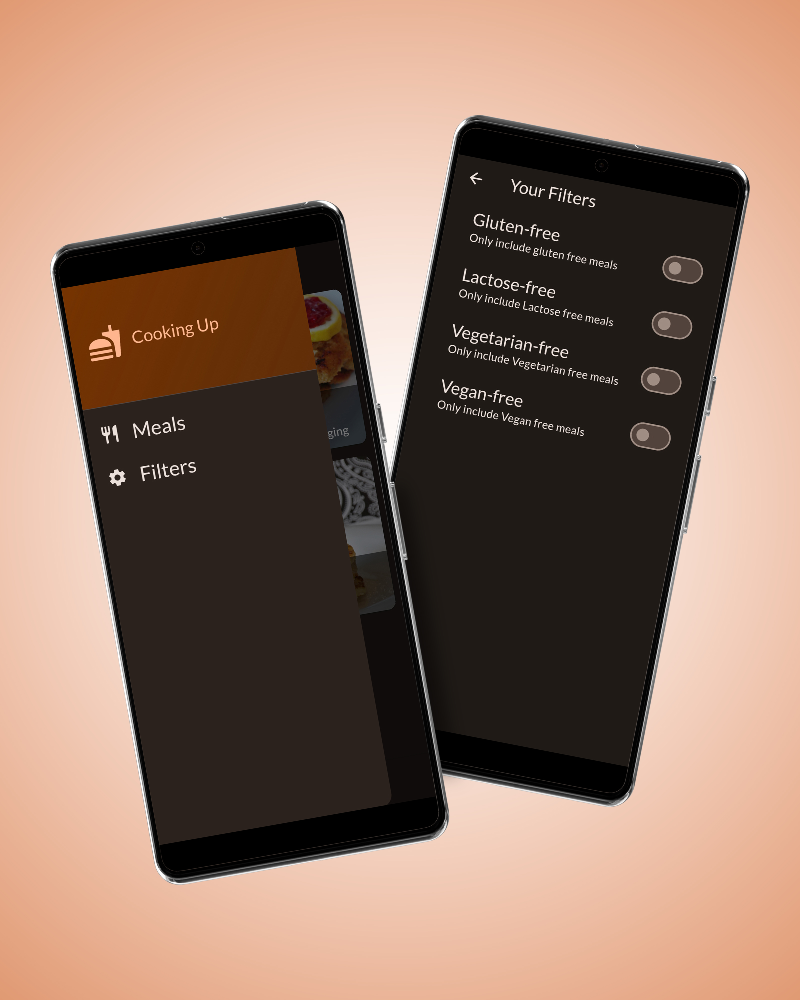

# 🍴 FoodMate

## 📱 App Screens:

  
  
  

---

## 📝 Description:

**FoodMate** is your ultimate meal companion app — designed to help you discover, explore, and organize a variety of meals effortlessly.
Whether you’re looking for a quick snack or a gourmet recipe, FoodMate lets you browse categorized meal lists, view detailed descriptions, and save your favorite dishes for easy access later.

With its clean design and intuitive navigation, FoodMate makes meal discovery simple, enjoyable, and inspiring. 🍛

---

## 🌟 Features:

### 🍽️ Categorized Meals

Explore a wide range of meals organized by categories such as cuisine, type, or preference for quick and easy navigation.

### 📖 Meal Details

Get complete meal information — including ingredients, preparation steps, and cooking methods — all in one place.

### ❤️ Favorites

Mark your favorite meals and access them anytime from your dedicated favorites section.

### 🔍 Sorting & Filtering

Sort and filter meals based on your dietary preferences, cooking time, or ingredients to find the perfect match.

---

## 🛠️ Tech Stack

* **Framework:** Flutter
* **Language:** Dart
* **State Management:** Provider / setState
* **Platform:** Android & iOS

---

## 🚀 Future Enhancements

* Meal search by ingredient
* Calorie and nutrition tracking
* Offline access to saved recipes
* Dark mode support

---

## 💡 About

**FoodMate** is built with Flutter to deliver a fast, beautiful, and cross-platform meal exploration experience for food enthusiasts around the world.

